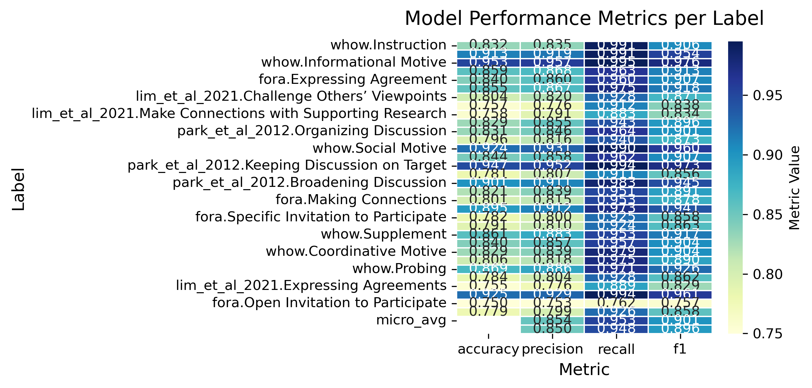

## Taxonomy Annotation

### Detecting facilitative comments
We consider a comment to be facilitative if it is either marked as such in the original dataset, or if our classifier believes it to be with a confidence of more than $60\%$ (see [facilitation detection documentation](./facilitation_detection.md)).

Literature has shown that comments not made by facilitators can still be facilitative, which is why we include comments not necessarily made by facilitators in datasets where they are clearly labelled as such.

### Sampling
Since the wikidisputes, wikitactics and wikiconv datasets represent the same population, we consider them the same dataset in this analysis ("wikipedia").

Additionally, since the sizes of our datasets do not reflect real-world population sizes, we select the same number of facilitative comments from each dataset. Thus, a maximum of $2000$ comments is drawn from each dataset. Some datasets have a lower count of comments bringing the total of comments to $12864$. The inclusion of the $60\%$ threshold mitigates this imbalance.

### LLM Classification
- [Execution script](../scripts/annotate_taxonomies.py)

We reduce each of the four taxonomies (see [the taxonomy file](llm_classification/taxonomy.yaml)) to single-level classifications, group by the taxonomy they belong to. We then run a binary classification task using an open-source LLM for each of these 32 tactics (we ignore the "Mixed Motive" tactic from WHoW, since our classification formulation inherently takes care of multiple labels).

For each tactic we include the name, description and a few examples, which were provided by the papers introducing them. For each comment we include its contents, as well as two preceding comments as context. Each comment is allowed a maximum of $2000$ characters due to VRAM concerns.

We use a LLaMa3.3-70b instruction-tuned model quantized to four bits. The instruction prompt can be found [in this file](llm_classification/prompt.txt). Execution time was 35 days. The experiments were run on two Quadro RTX GPUs.

### Transformer-model Classification

- [Training script](../scripts/taxonomy_train.py)
- [Inference script](../scripts/taxonomy_inference.py)

In order to annotate the entire dataset with each of the 32 tactics, we train a [Modern Bert](https://huggingface.co/docs/transformers/main/model_doc/modernbert) model on the LLM-annotated data. We do not use the human annotations provided by some of the datasets. The results are then appended to the dataset.

We use a context width of four comments, utilizing the same XML schema as in [facilitation detection](./facilitation_detection.md), with the same length restrictions.

Our model performs exceptionally well in almost all tactics. A summary of the evaluation on the test-set can be found below.

Training and inference were executed on a single Quadro RTX GPU. Training time was approximately 8 hours, and inference time 50 hours. 

